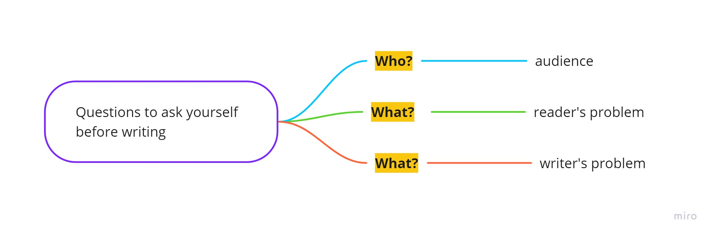

# Effective text communication

> Ability to communicate clearly is essential skill in modern working environments where communication flows are going continuously.
> On your style depends how fast and precise the answer for your question will be.

When communicating your message to someone there are 3 questions you can ask yourself:
* Who? is the recipient.
* What? reader's task or problem does it solve.
* What? writer's problem does it solve.

## Whom? is you gonna write. 
Keep in mind that you should adapt your message for an audience you are trying to write.
Consider that you are trying to explain something to a child. Usually you use metaphors, fairytales or images.
Basically you tune your speech for the audience. The same approach could be used in the work communication.
Generally:
 * If you write to business person - remove all the language and details he will not aware of.
 * If you write to technical guy, use technical terms freely.

> Remember that ability to explain complex ideas in simple words is one of the most valuable soft skills.

## What? reader's task or problem does it solve.
* Think about the problem you are solving.
* Remove all details that does not accommodate the goal or problem. 
I suggest to use problem (+relevance) -> solution approach. That means that at the beginning you announce the problem and it's relevance and then solution.    

When trying to explain your solution, ask 5 WH questions and 1 How to your explanation.  
Good practice is to put the core message to the beginning. This way the reader will catch main idea and the other part of the message will be an addition to it.
Be as precise as possible and eliminate details which are not relate to the problem.

> Show your respect and ability to solve the reader's problem through the text.

## What? writer's problem does it solve.

## Summary

#### TDB
add - do not expect immediate answer.
the less additional questions you asked - the better.

