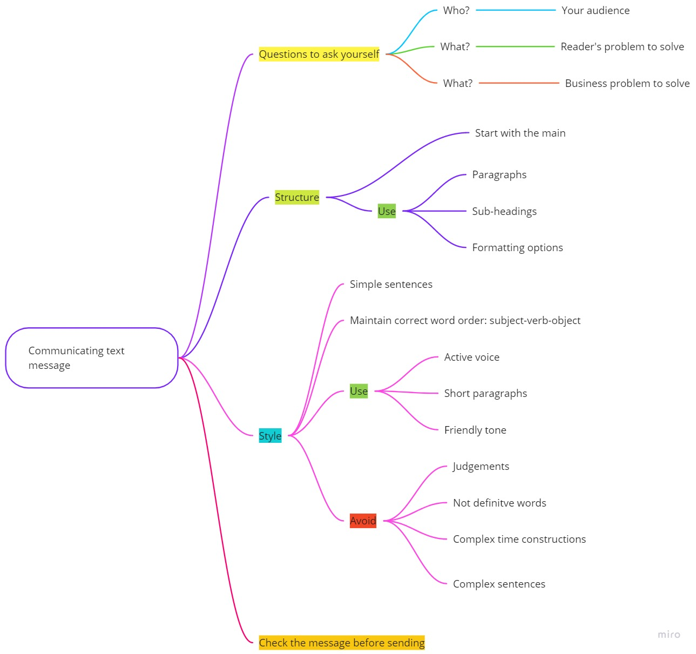

# Text communication practices

> Ability to communicate clearly is essential skill in modern working environments where communication flows are going continuously.
> On your style depends how fast and precise the answer for your question will be.

Interesting, that programming principles can be used when writing technical texts:
* KISS - keep it simple, stupid
* DRY - do not repeat yourself
* Divide the text to separate parts(the same as code)
* Use style guides.

When communicating your message to someone there are 3 questions you can ask yourself:
* Whom? is you gonna write.
* What? reader's task or problem does it solve.
* What? business problem does it solve.

## Whom? is you gonna write. 
Keep in mind that you should adapt your message for an audience you are trying to write.
Consider that you are trying to explain something to a child. Usually you use metaphors, fairytales or images.
Basically you tune your speech for the audience. The same approach could be used in the work communication.
Generally:
 * If you write to business person - remove all the language and details he will not aware of.
 * If you write to technical guy, use technical terms freely.
Also think about how your text will be used.

> Remember that ability to explain complex ideas in simple words is one of the most valuable soft skills.

## What? reader's task or problem does it solve.
* Think about the problem you are solving.
* Remove all details that does not accommodate the goal or problem. 
I suggest to use problem (+relevance) -> solution approach. That means that at the beginning you announce the problem and it's relevance and then solution.    

When trying to explain your solution, ask WH (What? When? Which? Why? Where?) questions and 1 How to your explanation.  

Good practice is to put the core message to the beginning ([the "Pyramid" principle](https://www.linkedin.com/pulse/pyramid-principle-explained-heba-abusedou)). This way the reader will catch main idea and the other part of the message will be an addition to it.
Be as precise as possible and eliminate details which are not related to the problem.

> Show your respect and ability to solve the reader's problem through the text.

## What? Business problem does it solve.
Think how you gonna solve the problem. Describe the solution in the most simple way. Provide multiple solutions if possible.

## Structure
* Start with the main. Repeat the idea multiple times if your text is long.
* Create paragraphs
* Use sub-headings
* Use formatting options like bold font, color highlighting and underlined text. But not overuse this. Remember that if you use this formatting options it should be obvious for the reader why you used bold or underlined text in this particular place.

> Your messsage should look like well-formatted magazine article. Beautiful and attractive to look through. 

## Style
* Use simple sentences in your message.
   * [List of simple alternatives for complex words.](https://plainlanguage.gov/guidelines/words/use-simple-words-phrases/)
* Maintain correct word order: subject-verb-object.
* Prefer Active voice.
* Use short paragraphs. This way your text will be easier for quick glancing and catching the main idea.
* Use frinedly tone, dont be rude.
### Try to avoid
* Judgments: simply ,easily, hardly and others.
* Not definitive words: technically, probably, literally, a bit, basically, just, seems, somehow.
* Complex time constructions.
* Complex sentences.

## How to check the message before sending?
Check yourself before sending the message.
* Ask the following question: do I need additional questions to understand the matter? The less questions the reader will ask you - the better.
* Read the message and try to find structure discrepancies, logic errors.

## Summary
Ask 3 questions to yourself when writing the message:
* Whom? is you gonna write.
* What? reader's task or problem does it solve.
* What? business problem does it solve.

Maintain clear structure. Use simple easy-to-understand style.
Check yourself before sending.

Good text is the same [as good question os the StackOverFlow](https://stackoverflow.com/help/how-to-ask):
* Easy to understand
* With clear and concrete subject 
* Good formatting

#### TDB
add - do not expect immediate answer.
Update the picture at the beginning.
Add useful links.

